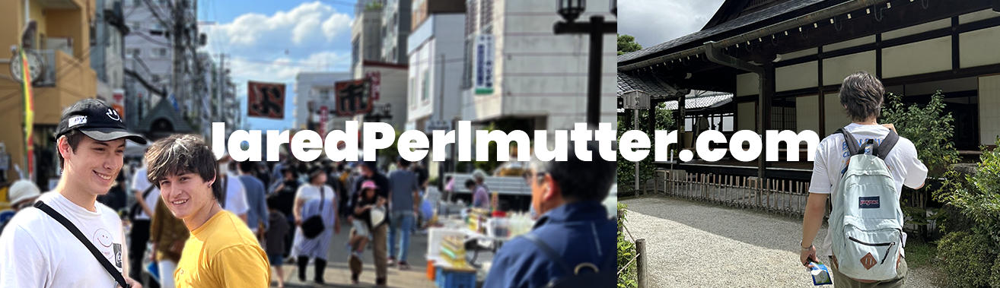

## Hi there, I'm Jared! 👋

こんにちは! I'm Jared Perlmutter, a passionate programmer with a strong interest in big-data, IoT, and emerging technologies. I thrive on exploring how technology can shape the future and love working on projects that challenge my skills and creativity.

## Skills & Tech Stack

**Languages:**
-  JavaScript
-  Java
-  C++
-  PowerShell
-  HTML
-  Python

**Libraries/Tools:**
-  OpenCV
-  NPM
-  Various SAP Applications

**IDEs:**
-  Eclipse
-  Visual Studio Code
-  Visual Studio SQL
-  IntelliJ
-  MySQL Workbench
-  Oracle Live SQL

**Applications:**
-  Unity
-  Photoshop
-  Premiere Pro
-  Blender
-  Notion

## Current Projects

- 🌐 I'm currently working on a **website project** using Babylon.js and LiquidFun, blending physics simulations with interactive 2D graphics.

## Education

- 🎓 **Waseda University** (Summer 2023)
- 🎓 **University of Texas at Dallas**

## Interests

When I'm not programming, you can find me:
- Traveling (especially to Japan) ✈️
- Learning Japanese :crossed_flags:
- Weightlifting, playing water polo, and swimming 🏋️‍♂️🏊‍♂️
- Producing music, cooking, and recording videos for the Japanese learning community 🎶🍳🎥

## Contact

- 📧 Email: [jperlmutter1@gmail.com](mailto:jperlmutter1@gmail.com)
- 💼 LinkedIn: [Jared Perlmutter](https://www.linkedin.com/in/jaredperlmutter)

## Quote I Live By
*"一日を甘んじて、悠々生きるのは大切だ"*

*It's important to live each day with ease and acceptance.*

